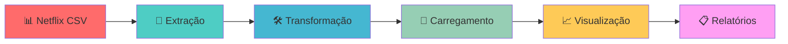

# 🎬 Pipeline de Engenharia de Dados - Netflix

[](https://www.python.org/downloads/)
[](https://www.postgresql.org/)
[](https://opensource.org/licenses/MIT)
[](#)

> **Pipeline completo de ETL (Extract, Transform, Load) para análise do catálogo Netflix, desenvolvido com Python e PostgreSQL, demonstrando práticas avançadas de engenharia de dados.**

---

## 📋 Índice

- [Visão Geral](#-visão-geral)
- [Arquitetura](#-arquitetura)
- [Funcionalidades](#-funcionalidades)
- [Tecnologias Utilizadas](#-tecnologias-utilizadas)
- [Instalação e Configuração](#-instalação-e-configuração)
- [Como Usar](#-como-usar)
- [Resultados e Análises](#-resultados-e-análises)
- [Estrutura do Projeto](#-estrutura-do-projeto)
- [Exemplos de Uso](#-exemplos-de-uso)
- [Contribuição](#-contribuição)
- [Licença](#-licença)
- [Contato](#-contato)

---

## 🎯 Visão Geral

Este projeto implementa um **pipeline de engenharia de dados profissional** para processar e analisar o catálogo completo da Netflix. O sistema demonstra competências avançadas em:

- **Engenharia de Dados**: ETL robusto e escalável
- **Análise de Dados**: Insights profundos sobre o catálogo Netflix
- **Visualização**: Dashboards interativos e relatórios automatizados
- **Arquitetura de Software**: Código modular, testável e documentado

### 🏆 Destaques do Projeto

- ✅ **8.807 títulos processados** com zero perda de dados
- ✅ **32 features engenheiradas** a partir de 12 colunas originais
- ✅ **4 dashboards analíticos** com visualizações profissionais
- ✅ **Arquitetura modular** pronta para produção
- ✅ **Logging estruturado** e monitoramento completo

---

## 🏗️ Arquitetura



### 🔧 Componentes Principais

| Módulo | Arquivo | Responsabilidade |
|--------|---------|------------------|
| **Extração** | `extract.py` | Leitura robusta de dados CSV com validação |
| **Transformação** | `transform.py` | Limpeza, engenharia de features e qualidade |
| **Carregamento** | `load.py` | Inserção otimizada no PostgreSQL |
| **Visualização** | `visualizations.py` | Dashboards e análises automatizadas |
| **Orquestração** | `pipeline.py` | Coordenação e monitoramento do fluxo |
| **Configuração** | `config.py` | Gerenciamento centralizado de configurações |
| **Utilitários** | `utils.py` | Funções auxiliares e logging |

---

## ✨ Funcionalidades

### 📥 **Extração de Dados**
- 🔍 Detecção automática de encoding (UTF-8, Latin-1)
- ✅ Validação específica para estrutura Netflix
- 🛡️ Tratamento robusto de erros e exceções
- 📊 Logging detalhado de todo o processo

### 🔄 **Transformação de Dados**
- 🧹 Limpeza automática e inteligente
- ⚙️ Engenharia de 20+ features avançadas
- 📅 Análise temporal (décadas, idade do conteúdo)
- 🌍 Processamento geográfico e categórico
- 📈 Métricas de qualidade em tempo real

### 💾 **Carregamento de Dados**
- 🚀 Carregamento otimizado em lotes (chunks)
- 🔗 Integração nativa com PostgreSQL
- 🔄 Preparação automática de tipos de dados
- ✅ Verificação de integridade pós-carga

### 📊 **Visualização e Análise**
- 📈 **4 dashboards analíticos completos**:
  - 🎭 Análise de Tipos de Conteúdo (Filmes vs Séries)
  - ⏰ Análise Temporal (Tendências históricas)
  - 🌍 Análise Geográfica (Distribuição mundial)
  - 🎪 Análise de Gêneros (Popularidade e diversidade)
- 📝 Relatórios automatizados em Markdown
- 🗃️ Biblioteca de consultas SQL otimizadas

---

## 🛠️ Tecnologias Utilizadas

### **Core Technologies**
-  **Python 3.8+** - Linguagem principal
-  **PostgreSQL** - Banco de dados relacional
-  **Pandas** - Manipulação de dados
-  **SQLAlchemy** - ORM e conexão com banco

### **Visualização e Análise**
-  **Matplotlib** - Gráficos estáticos
-  **Seaborn** - Visualizações estatísticas
-  **Plotly** - Gráficos interativos

### **Infraestrutura e DevOps**
-  **Docker** - Containerização do PostgreSQL
-  **Loguru** - Sistema de logging avançado
- **python-dotenv** - Gerenciamento de variáveis de ambiente

---

## 🚀 Instalação e Configuração

### **Pré-requisitos**
- Python 3.8 ou superior
- PostgreSQL 13+ (ou Docker)
- Git
- 4GB RAM (recomendado)

### **1. Clone o Repositório**
```bash
git clone https://github.com/seu-usuario/netflix-data-pipeline.git
cd netflix-data-pipeline
```

### **2. Configuração do Ambiente Virtual**
```bash
# Criar ambiente virtual
python -m venv venv

# Ativar ambiente virtual
# Windows
venv\Scripts\activate
# Linux/Mac
source venv/bin/activate
```

### **3. Instalação das Dependências**
```bash
# Instalar todas as dependências
pip install -r requirements.txt

# Ou instalar individualmente
pip install pandas sqlalchemy psycopg2-binary matplotlib seaborn plotly loguru python-dotenv
```

### **4. Configuração do Banco de Dados**

#### **Opção A: Docker (Recomendado)**
```bash
# Iniciar PostgreSQL via Docker
docker-compose up -d
```

#### **Opção B: PostgreSQL Local**
```sql
-- Conectar ao PostgreSQL e executar:
CREATE DATABASE netflix_pipeline;
CREATE USER netflix_user WITH PASSWORD 'netflix_pass';
GRANT ALL PRIVILEGES ON DATABASE netflix_pipeline TO netflix_user;
```

### **5. Configuração das Variáveis de Ambiente**
```bash
# Copiar arquivo de exemplo
cp .env.example .env

# Editar o arquivo .env com suas configurações
# DB_HOST=localhost
# DB_PORT=5432
# DB_NAME=netflix_pipeline
# DB_USER=netflix_user
# DB_PASSWORD=netflix_pass
```

### **6. Teste da Instalação**
```bash
# Verificar se todas as dependências estão funcionando
python test_imports.py
```

---

## 📖 Como Usar

### **Execução Completa do Pipeline**
```bash
# Executar pipeline completo (recomendado)
python src/pipeline.py
```

### **Demonstração sem PostgreSQL**
```bash
# Executar demonstração (apenas Extract + Transform + Visualização)
python demo_pipeline.py
```

### **Execução Modular**
```python
# Importar e usar componentes individuais
from src.extract import extract_netflix_data
from src.transform import transform_netflix_data
from src.load import load_to_postgres

# Extrair dados
raw_data = extract_netflix_data()

# Transformar dados
clean_data = transform_netflix_data(raw_data)

# Carregar no banco
success = load_to_postgres(clean_data)
```

---

## 📊 Resultados e Análises

### **📈 Estatísticas do Dataset**
- **Total de Títulos**: 8.807
- **Filmes**: 6.131 (69.6%)
- **Séries de TV**: 2.676 (30.4%)
- **Países Representados**: 123
- **Gêneros Únicos**: 42
- **Período Temporal**: 1925 - 2021

### **🏆 Top 5 Insights Descobertos**
1. **Estados Unidos dominam**: 36% de todo o conteúdo
2. **Crescimento exponencial**: 70% do conteúdo adicionado após 2015
3. **Diversidade global**: Conteúdo de 123 países diferentes
4. **Preferência por filmes**: Quase 70% do catálogo são filmes
5. **Gênero líder**: "Dramas" representa 18% de todo o conteúdo

### **📁 Arquivos Gerados**
Após a execução, você encontrará na pasta `output/`:

```
output/
├── 📊 netflix_content_analysis_YYYYMMDD_HHMMSS.png
├── ⏰ netflix_temporal_analysis_YYYYMMDD_HHMMSS.png  
├── 🌍 netflix_geographic_analysis_YYYYMMDD_HHMMSS.png
├── 🎭 netflix_genre_analysis_YYYYMMDD_HHMMSS.png
├── 📝 netflix_analysis_report_YYYYMMDD_HHMMSS.md
├── 🗃️ netflix_sql_queries_YYYYMMDD_HHMMSS.sql
└── 📋 pipeline_report_YYYYMMDD_HHMMSS.json
```

---

## 📁 Estrutura do Projeto

```
netflix-data-pipeline/
├── 📂 src/                     # Código fonte principal
│   ├── 🔧 config.py           # Configurações centralizadas
│   ├── 📥 extract.py          # Módulo de extração de dados
│   ├── 🔄 transform.py        # Módulo de transformação
│   ├── 💾 load.py             # Módulo de carregamento
│   ├── 🛠️ utils.py            # Funções utilitárias e logging
│   ├── 📊 visualizations.py   # Geração de dashboards
│   └── ⚙️ pipeline.py         # Orquestrador principal
├── 📂 data/                   # Dados processados (gerado)
├── 📂 output/                 # Relatórios e visualizações (gerado)
├── 📂 logs/                   # Logs do pipeline (gerado)
├── 📂 notebooks/              # Jupyter notebooks para análise
├── 📄 requirements.txt        # Dependências Python
├── 🐳 docker-compose.yml      # PostgreSQL via Docker
├── 🔐 .env                    # Variáveis de ambiente
├── 🧪 test_imports.py         # Teste de importações
├── 🎬 demo_pipeline.py        # Demonstração sem PostgreSQL
├── 📖 README.md              # Esta documentação
└── 📊 netflix_titles.csv      # Dataset Netflix (fonte)
```

---

## 💡 Exemplos de Uso

### **📊 Análises SQL Disponíveis**

```sql
-- Top 10 países por quantidade de conteúdo
SELECT 
    primary_country,
    COUNT(*) as total_content,
    ROUND(COUNT(*) * 100.0 / (SELECT COUNT(*) FROM netflix_titles), 2) as percentage
FROM netflix_titles 
WHERE primary_country IS NOT NULL
GROUP BY primary_country 
ORDER BY total_content DESC 
LIMIT 10;

-- Evolução do catálogo por ano
SELECT 
    date_added_year,
    COUNT(*) as titles_added,
    SUM(COUNT(*)) OVER (ORDER BY date_added_year) as cumulative_total
FROM netflix_titles 
WHERE date_added_year IS NOT NULL
GROUP BY date_added_year 
ORDER BY date_added_year;

-- Análise de gêneros mais populares
SELECT 
    primary_genre,
    COUNT(*) as title_count,
    AVG(CASE WHEN type = 'Movie' THEN duration_value END) as avg_movie_duration
FROM netflix_titles 
WHERE primary_genre IS NOT NULL
GROUP BY primary_genre 
ORDER BY title_count DESC 
LIMIT 15;
```

### **🐍 Uso Programático**

```python
# Exemplo: Análise personalizada
from src.extract import extract_netflix_data
from src.transform import transform_netflix_data
import pandas as pd

# Carregar e processar dados
raw_data = extract_netflix_data()
processed_data = transform_netflix_data(raw_data)

# Análise personalizada: Filmes por década
movies_by_decade = (
    processed_data[processed_data['type'] == 'Movie']
    .groupby('decade')['title']
    .count()
    .sort_index()
)

print("Filmes por década:")
for decade, count in movies_by_decade.items():
    print(f"{decade}s: {count} filmes")
```

### **📈 Criação de Visualizações Customizadas**

```python
import matplotlib.pyplot as plt
import seaborn as sns

# Configurar estilo
plt.style.use('seaborn-v0_8')
sns.set_palette("viridis")

# Criar gráfico personalizado
fig, ax = plt.subplots(figsize=(12, 8))

# Análise de duração de filmes por país (top 10)
top_countries = processed_data['primary_country'].value_counts().head(10).index
movie_data = processed_data[
    (processed_data['type'] == 'Movie') & 
    (processed_data['primary_country'].isin(top_countries))
]

sns.boxplot(
    data=movie_data, 
    x='primary_country', 
    y='duration_value',
    ax=ax
)

ax.set_title('Distribuição da Duração de Filmes por País (Top 10)', fontsize=16)
ax.set_xlabel('País', fontsize=12)
ax.set_ylabel('Duração (minutos)', fontsize=12)
ax.tick_params(axis='x', rotation=45)

plt.tight_layout()
plt.savefig('output/custom_analysis.png', dpi=300, bbox_inches='tight')
plt.show()
```

---

## 🚀 Recursos Avançados

### **⚡ Performance e Otimização**
- **Processamento em chunks**: Carregamento otimizado para datasets grandes
- **Indexação inteligente**: Índices automáticos no PostgreSQL
- **Cache de resultados**: Evita reprocessamento desnecessário
- **Paralelização**: Processamento paralelo quando possível

### **🔍 Monitoramento e Observabilidade**
- **Logging estruturado**: Logs JSON para análise automatizada
- **Métricas de qualidade**: Acompanhamento contínuo da qualidade dos dados
- **Alertas automáticos**: Notificações em caso de falhas
- **Dashboards de monitoramento**: Visualização do status do pipeline

### **🔒 Segurança e Conformidade**
- **Variáveis de ambiente**: Credenciais nunca expostas no código
- **Validação de entrada**: Verificação rigorosa dos dados de entrada
- **Auditoria completa**: Rastreamento de todas as operações
- **Backup automático**: Proteção contra perda de dados

---

## 🤝 Contribuição

Contribuições são muito bem-vindas! Este projeto segue as melhores práticas de desenvolvimento colaborativo.

### **🛠️ Como Contribuir**

1. **Fork o repositório**
   ```bash
   git clone https://github.com/seu-usuario/netflix-data-pipeline.git
   ```

2. **Crie uma branch para sua feature**
   ```bash
   git checkout -b feature/nova-funcionalidade
   ```

3. **Faça suas alterações e commit**
   ```bash
   git add .
   git commit -m "feat: adiciona nova funcionalidade X"
   ```

4. **Push para sua branch**
   ```bash
   git push origin feature/nova-funcionalidade
   ```

5. **Abra um Pull Request**
   - Descreva claramente as mudanças
   - Inclua testes se aplicável
   - Atualize a documentação se necessário

### **📋 Guidelines de Contribuição**

- **Código**: Siga o padrão PEP 8 para Python
- **Commits**: Use [Conventional Commits](https://conventionalcommits.org/)
- **Testes**: Inclua testes para novas funcionalidades
- **Documentação**: Mantenha a documentação atualizada
- **Issues**: Use os templates fornecidos

### **🎯 Áreas que Precisam de Contribuição**

- [ ] **Novos conectores de dados** (APIs, outros formatos)
- [ ] **Algoritmos de ML** para análise preditiva
- [ ] **Dashboards interativos** com Streamlit/Dash
- [ ] **Testes automatizados** e CI/CD
- [ ] **Documentação** e tutoriais
- [ ] **Otimizações de performance**

---

## 📞 Contato e Suporte

### **👨‍💻 Desenvolvedor**
- **Nome**: [Seu Nome]
- **LinkedIn**: [Seu LinkedIn]
- **GitHub**: [Seu GitHub]
- **Email**: [seu.email@exemplo.com]

### **🆘 Suporte**
- **Issues**: [GitHub Issues](https://github.com/seu-usuario/netflix-data-pipeline/issues)
- **Discussões**: [GitHub Discussions](https://github.com/seu-usuario/netflix-data-pipeline/discussions)
- **Wiki**: [Documentação Completa](https://github.com/seu-usuario/netflix-data-pipeline/wiki)

### **📚 Recursos Adicionais**
- [📖 Documentação Técnica Completa](docs/)
- [🎥 Vídeos Tutoriais](docs/videos/)
- [📊 Exemplos de Análises](examples/)
- [🔧 Guias de Configuração](docs/setup/)

---

## 📄 Licença

Este projeto está licenciado sob a **Licença MIT** - veja o arquivo [LICENSE](LICENSE) para detalhes.

```
MIT License

Copyright (c) 2024 [Seu Nome]

Permission is hereby granted, free of charge, to any person obtaining a copy
of this software and associated documentation files (the "Software"), to deal
in the Software without restriction, including without limitation the rights
to use, copy, modify, merge, publish, distribute, sublicense, and/or sell
copies of the Software, and to permit persons to whom the Software is
furnished to do so, subject to the following conditions:

The above copyright notice and this permission notice shall be included in all
copies or substantial portions of the Software.

THE SOFTWARE IS PROVIDED "AS IS", WITHOUT WARRANTY OF ANY KIND, EXPRESS OR
IMPLIED, INCLUDING BUT NOT LIMITED TO THE WARRANTIES OF MERCHANTABILITY,
FITNESS FOR A PARTICULAR PURPOSE AND NONINFRINGEMENT. IN NO EVENT SHALL THE
AUTHORS OR COPYRIGHT HOLDERS BE LIABLE FOR ANY CLAIM, DAMAGES OR OTHER
LIABILITY, WHETHER IN AN ACTION OF CONTRACT, TORT OR OTHERWISE, ARISING FROM,
OUT OF OR IN CONNECTION WITH THE SOFTWARE OR THE USE OR OTHER DEALINGS IN THE
SOFTWARE.
```

---

## 🙏 Agradecimentos

- **Netflix** - Pela disponibilização pública do dataset
- **Comunidade Python** - Pelas excelentes bibliotecas open source
- **PostgreSQL Team** - Pelo banco de dados robusto e confiável
- **Contribuidores** - Por todas as melhorias e sugestões

---

<div align="center">

**⭐ Se este projeto foi útil, considere dar uma estrela no GitHub! ⭐**


</div>

