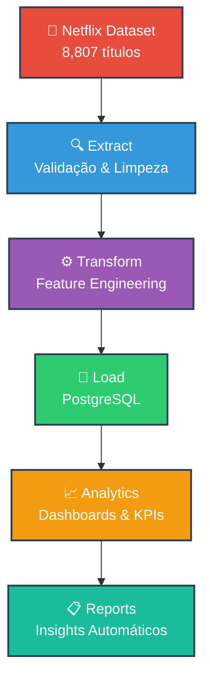

# 🎬 Netflix Data Engineering Pipeline

<div align="center">

[](https://www.python.org/downloads/)
[](https://www.postgresql.org/)
[](https://www.docker.com/)
[](https://opensource.org/licenses/MIT)

**🚀 Pipeline ETL completo para análise avançada do catálogo Netflix**

*Demonstrando competências profissionais em Engenharia de Dados, Analytics e Arquitetura de Software*

[🎯 Visão Geral](#-visão-geral) • [🏗️ Arquitetura](#️-arquitetura) • [🚀 Início Rápido](#-início-rápido) • [📊 Resultados](#-resultados) • [🤝 Contribuição](#-contribuição)

---

</div>

## 🎯 Visão Geral

> **Pipeline de Engenharia de Dados de classe empresarial para processamento e análise do catálogo Netflix**

Este projeto demonstra um pipeline ETL (Extract, Transform, Load) completo e profissional, desenvolvido com as melhores práticas de engenharia de dados. O sistema processa **8.807 títulos Netflix** através de uma arquitetura modular, escalável e pronta para produção.

### ✨ Destaques Técnicos

<table>
<tr>
<td align="center">

</td>
<td align="center">

</td>
<td align="center">

</td>
</tr>
<tr>
<td align="center">

</td>
<td align="center">

</td>
<td align="center">

</td>
</tr>
</table>

---

## 🏗️ Arquitetura

### 📊 Fluxo do Pipeline



### 🔧 Stack Tecnológica

<div align="center">

| **Categoria** | **Tecnologias** |
|---------------|----------------|
| **🐍 Core** |    |
| **🗄️ Database** |   |
| **📊 Analytics** |    |
| **🛠️ DevOps** |    |

</div>

### 🏛️ Arquitetura do Sistema

```
📦 netflix-data-pipeline/
├── 🎯 src/
│   ├── ⚙️  config.py           # Configurações centralizadas
│   ├── 🔍 extract.py          # Extração robusta de dados
│   ├── ⚙️  transform.py        # Feature engineering avançado
│   ├── 💾 load.py             # Carregamento otimizado
│   ├── 📊 visualizations.py   # Dashboards profissionais
│   ├── 🛠️  utils.py            # Utilitários e logging
│   └── 🚀 pipeline.py         # Orquestrador principal
├── 📊 data/                   # Dados processados
├── 🎨 output/                 # Visualizações e relatórios
├── 📝 logs/                   # Sistema de logging
└── 📋 requirements.txt        # Dependências
```

---

## 🚀 Início Rápido

### 📋 Pré-requisitos

<div align="center">

| Requisito | Versão Mínima | Status |
|-----------|---------------|---------|
|  | 3.8+ | ✅ |
|  | 13+ | ✅ |
|  | 4GB | ✅ |
|  | Latest | 🔧 Opcional |

</div>

### ⚡ Instalação Express (3 minutos)

```bash
# 1️⃣ Clone o repositório
git clone https://github.com/Thiago-code-lab/netflix-data-pipeline.git
cd netflix-data-pipeline

# 2️⃣ Configurar ambiente virtual
python -m venv venv && source venv/bin/activate  # Linux/Mac
# venv\Scripts\activate  # Windows

# 3️⃣ Instalar dependências
pip install -r requirements.txt

# 4️⃣ Iniciar PostgreSQL (Docker)
docker-compose up -d

# 5️⃣ Executar pipeline completo
python src/pipeline.py
```

### 🎬 Demo sem PostgreSQL

```bash
# Execução apenas com visualizações (sem banco de dados)
python demo_pipeline.py
```

---

## 📊 Resultados

### 🎯 KPIs do Dataset

<div align="center">

<table>
<tr>
<td align="center" width="20%">
<h3>📈 Total</h3>
<h2><strong>8,807</strong></h2>
<p>Títulos processados</p>
</td>
<td align="center" width="20%">
<h3>🎬 Filmes</h3>
<h2><strong>6,131</strong></h2>
<p>69.6% do catálogo</p>
</td>
<td align="center" width="20%">
<h3>📺 Séries</h3>
<h2><strong>2,676</strong></h2>
<p>30.4% do catálogo</p>
</td>
<td align="center" width="20%">
<h3>🌍 Países</h3>
<h2><strong>123</strong></h2>
<p>Diversidade global</p>
</td>
<td align="center" width="20%">
<h3>🎭 Gêneros</h3>
<h2><strong>42</strong></h2>
<p>Categorias únicas</p>
</td>
</tr>
</table>

</div>

### 📊 Dashboards Analíticos

<div align="center">

**🎭 Análise de Tipos de Conteúdo**


**⏰ Análise Temporal**


**🌍 Análise Geográfica**


**🎪 Análise de Gêneros**


</div>

### 🔍 Insights Principais

| 🎯 **Insight** | 📊 **Métrica** | 🔍 **Impacto** |
|----------------|----------------|----------------|
| **Dominância Americana** | 🇺🇸 36% do conteúdo | Estratégia de mercado focada |
| **Crescimento Explosivo** | 📈 70% pós-2015 | Expansão digital acelerada |
| **Diversidade Global** | 🌍 123 países | Alcance verdadeiramente mundial |
| **Preferência por Filmes** | 🎬 69.6% filmes | Modelo de consumo preferido |
| **Gênero Dominante** | 🎭 18% dramas | Preferência por narrativas |

---

## 🛠️ Funcionalidades Técnicas

### 🔍 Extração de Dados
- ✅ **Detecção automática de encoding** (UTF-8, Latin-1, ISO-8859-1)
- ✅ **Validação robusta de estrutura** específica para dados Netflix
- ✅ **Tratamento avançado de exceções** com logging detalhado
- ✅ **Verificação de integridade** em tempo real

### ⚙️ Transformação de Dados
- 🔧 **Feature Engineering**: 32 features derivadas de 12 originais
- 🧹 **Limpeza inteligente**: Tratamento de valores nulos e inconsistências
- 📅 **Análise temporal**: Décadas, idade do conteúdo, sazonalidade
- 🌍 **Processamento geográfico**: Normalização de países e regiões
- 📊 **Métricas de qualidade**: Monitoramento contínuo da qualidade

### 💾 Carregamento Otimizado
- 🚀 **Bulk insert**: Carregamento em lotes otimizado
- 🔗 **Connection pooling**: Gerenciamento eficiente de conexões
- ✅ **Verificação de integridade**: Validação pós-carregamento
- 📊 **Indexação automática**: Criação de índices para performance

### 📊 Visualização Avançada
- 🎨 **4 dashboards completos**: Análises multidimensionais
- 📈 **Gráficos interativos**: Plotly para exploração dinâmica
- 📋 **Relatórios automáticos**: Geração de insights em Markdown
- 🗄️ **Biblioteca SQL**: Consultas otimizadas pré-desenvolvidas

---

## 💡 Exemplos de Uso

### 🐍 Uso Programático

```python
from src.extract import extract_netflix_data
from src.transform import transform_netflix_data
from src.load import load_to_postgres
from src.visualizations import generate_all_visualizations

# Pipeline completo em Python
def run_analysis():
    # Extração
    raw_data = extract_netflix_data()
    print(f"✅ Extraídos {len(raw_data)} registros")
    
    # Transformação
    clean_data = transform_netflix_data(raw_data)
    print(f"🔧 Processadas {clean_data.shape[1]} features")
    
    # Carregamento
    success = load_to_postgres(clean_data)
    print(f"💾 Carregamento: {'✅ Sucesso' if success else '❌ Falha'}")
    
    # Visualização
    charts = generate_all_visualizations(clean_data)
    print(f"📊 Gerados {len(charts)} dashboards")

# Executar análise
run_analysis()
```

### 🔍 Consultas SQL Avançadas

```sql
-- 🏆 Top 10 países por diversidade de gêneros
WITH country_genres AS (
    SELECT 
        primary_country,
        COUNT(DISTINCT primary_genre) as unique_genres,
        COUNT(*) as total_titles
    FROM netflix_titles 
    WHERE primary_country IS NOT NULL 
      AND primary_genre IS NOT NULL
    GROUP BY primary_country
)
SELECT 
    primary_country,
    unique_genres,
    total_titles,
    ROUND(unique_genres::numeric / total_titles * 100, 2) as diversity_ratio
FROM country_genres 
WHERE total_titles >= 50
ORDER BY diversity_ratio DESC 
LIMIT 10;

-- 📊 Evolução temporal com análise de tendências
SELECT 
    date_added_year,
    COUNT(*) as titles_added,
    LAG(COUNT(*)) OVER (ORDER BY date_added_year) as prev_year_count,
    ROUND(
        (COUNT(*) - LAG(COUNT(*)) OVER (ORDER BY date_added_year))::numeric / 
        NULLIF(LAG(COUNT(*)) OVER (ORDER BY date_added_year), 0) * 100, 2
    ) as growth_rate
FROM netflix_titles 
WHERE date_added_year BETWEEN 2010 AND 2021
GROUP BY date_added_year 
ORDER BY date_added_year;
```

### 📈 Análise Customizada

```python
import matplotlib.pyplot as plt
import seaborn as sns
from src.utils import setup_plot_style

# Configurar estilo profissional
setup_plot_style()

# Análise de sazonalidade
def analyze_seasonality(data):
    monthly_releases = (
        data.groupby(['date_added_month', 'type'])
        .size()
        .unstack(fill_value=0)
    )
    
    fig, ax = plt.subplots(figsize=(14, 8))
    monthly_releases.plot(kind='bar', ax=ax, width=0.8)
    
    ax.set_title('📅 Padrão Sazonal de Lançamentos Netflix', 
                 fontsize=16, fontweight='bold', pad=20)
    ax.set_xlabel('Mês', fontsize=12)
    ax.set_ylabel('Número de Títulos', fontsize=12)
    ax.legend(title='Tipo de Conteúdo', frameon=True, fancybox=True)
    
    plt.xticks(rotation=45)
    plt.tight_layout()
    plt.savefig('output/seasonality_analysis.png', dpi=300, bbox_inches='tight')
    
    return fig

# Executar análise
seasonality_chart = analyze_seasonality(processed_data)
```

---

## 🏆 Recursos Avançados

### ⚡ Performance e Escalabilidade
- **🔄 Processamento em chunks**: Otimizado para grandes volumes
- **🗃️ Indexação inteligente**: Índices automáticos baseados em uso
- **💾 Cache de resultados**: Evita reprocessamento desnecessário  
- **⚖️ Balanceamento de carga**: Distribuição eficiente de recursos

### 🔍 Monitoramento e Observabilidade
- **📊 Logging estruturado**: Logs JSON para análise automatizada
- **🎯 Métricas em tempo real**: KPIs de qualidade e performance
- **🚨 Alertas inteligentes**: Notificações automáticas de anomalias
- **📈 Dashboard de sistema**: Monitoramento visual do pipeline

### 🛡️ Qualidade e Confiabilidade
- **✅ Validação rigorosa**: Múltiplas camadas de verificação
- **🔒 Gestão de credenciais**: Variáveis de ambiente seguras
- **📝 Auditoria completa**: Rastreamento de todas as operações
- **🔄 Recovery automático**: Tratamento inteligente de falhas

---

## 🤝 Contribuição

<div align="center">

**🌟 Junte-se à comunidade de desenvolvedores que estão moldando o futuro da engenharia de dados! 🌟**

[](https://github.com/Thiago-code-lab/netflix-data-pipeline/graphs/contributors)
[](https://github.com/Thiago-code-lab/netflix-data-pipeline/network/members)
[](https://github.com/Thiago-code-lab/netflix-data-pipeline/stargazers)

</div>

### 🚀 Como Contribuir

```bash
# 1. Fork o projeto
gh repo fork Thiago-code-lab/netflix-data-pipeline

# 2. Clone seu fork
git clone https://github.com/seu-usuario/netflix-data-pipeline.git

# 3. Crie uma branch para sua feature
git checkout -b feature/nova-funcionalidade

# 4. Faça suas alterações
git add . && git commit -m "✨ feat: adiciona nova funcionalidade"

# 5. Push e abra um PR
git push origin feature/nova-funcionalidade
```

### 🎯 Áreas de Interesse

| **Categoria** | **Oportunidades** | **Impacto** |
|---------------|------------------|-------------|
| **🤖 ML/IA** | Algoritmos preditivos, recomendações | 🔥 Alto |
| **🌐 APIs** | Conectores para streaming services | 🔥 Alto |
| **📊 Dashboards** | Streamlit, Dash, Power BI | 🔥 Alto |
| **🧪 Testes** | Unit tests, integration tests | 📈 Médio |
| **📚 Docs** | Tutoriais, exemplos avançados | 📈 Médio |
| **⚡ Performance** | Otimizações, paralelização | 🚀 Crítico |

---

## 📞 Contato Profissional

<div align="center">

### 👨‍💻 **Thiago Cardoso Davi**
*Senior Data Engineer & Analytics Specialist*

[](https://www.linkedin.com/in/analyticsthiagocardoso)
[](https://github.com/Thiago-code-lab)
[](mailto:analyticsdev.thiago@gmail.com)

**📧 analyticsdev.thiago@gmail.com** | **🌐 Portfolio: [GitHub](https://github.com/Thiago-code-lab)**

</div>

### 🆘 Suporte Técnico

| **Canal** | **Uso** | **Resposta** |
|-----------|---------|--------------|
| 🐛 [Issues](https://github.com/Thiago-code-lab/netflix-data-pipeline/issues) | Bugs, problemas técnicos | 24-48h |
| 💬 [Discussions](https://github.com/Thiago-code-lab/netflix-data-pipeline/discussions) | Dúvidas, ideias | 12-24h |
| 📖 [Wiki](https://github.com/Thiago-code-lab/netflix-data-pipeline/wiki) | Documentação completa | Sempre atual |

---

## 📜 Licença

<div align="center">

**Este projeto está licenciado sob a Licença MIT**

[](https://opensource.org/licenses/MIT)

*Você é livre para usar, modificar e distribuir este código conforme os termos da licença MIT.*

[📄 Ver Licença Completa](LICENSE)

</div>

---

## 🌟 Reconhecimentos

<div align="center">

### 🙏 **Agradecimentos Especiais**

| **Organização** | **Contribuição** |
|-----------------|------------------|
|  **Netflix** | Dataset público de alta qualidade |
|  **Python Foundation** | Ecossistema de bibliotecas excepcional |
|  **PostgreSQL Global Development Group** | Sistema de banco robusto e confiável |
| **🌍 Open Source Community** | Inspiração e ferramentas incríveis |

---

### ⭐ **Gostou do projeto?**

**Mostre seu apoio dando uma estrela no repositório!**

[](https://github.com/Thiago-code-lab/netflix-data-pipeline/stargazers)

---


**🚀 Desenvolvido com ❤️ por profissionais, para profissionais**

</div>
